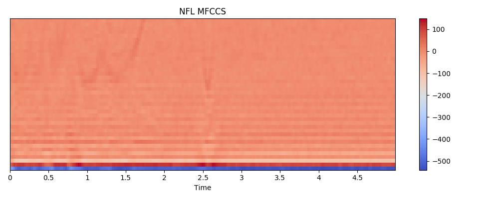
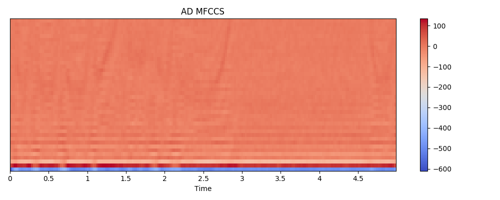

# audio-block
Machine learning for ad blocking during football games

Tested working with 95+% accuracy, to run simply 
1. Clone the repo
    - `git clone https://github.com/tlee753/audio-block`
2. Install the python module requirements
    - `pip3 install -r requirements.txt`
3. Run
    - `python3 audio-block-5.py`

### Mel Frequency Cepstrum Coefficient Spectogram Difference

**NFL**

**AD**

